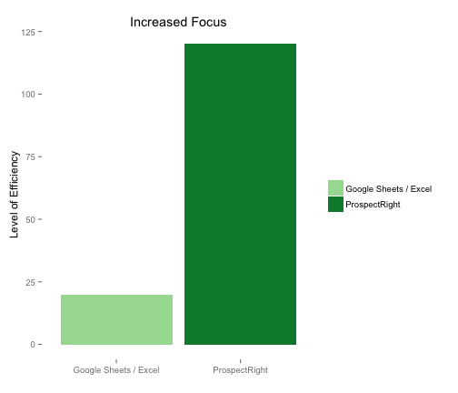
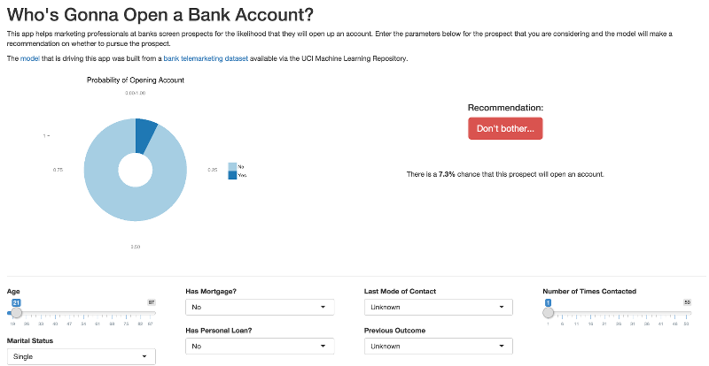

## Spend More Time With Your Best Prospects

#### Time is money 

With ProspectRight, you'll spend **more time with the _right_ people**!

---

## Quickly Weed Out Unlikely Prospects

#### Cut through all the noise and quickly identify those most interested in opening new accounts

---

## ProspectRight 2.0 is coming soon!

ProspectRight 2.0 will _blow your mind_ with these awesome benefits:

- Apply advanced, big data prediction models
- Customize your own probability thresholds
- Engage in advanced analytics
- Filter by different user segments
- Customize the parameters to fit your own data
- Estimate the expected opening balance of each prospect
- Predict at scale with bulk file uploads
    
[Sign-up](https://rashanjibowu.shinyapps.io/shinyapp/) now for a **30% discount** 

---

## The Best Thing Since Sliced Bread

*...* and definitely **way** better than boring spreadsheets!

Do yourself a favor:
- Check out the [app](https://rashanjibowu.shinyapps.io/shinyapp/)
- Check out the open-sourced code on [GitHub](https://github.com/rashanjibowu/bankmarketing/tree/master/shinyapp) 

